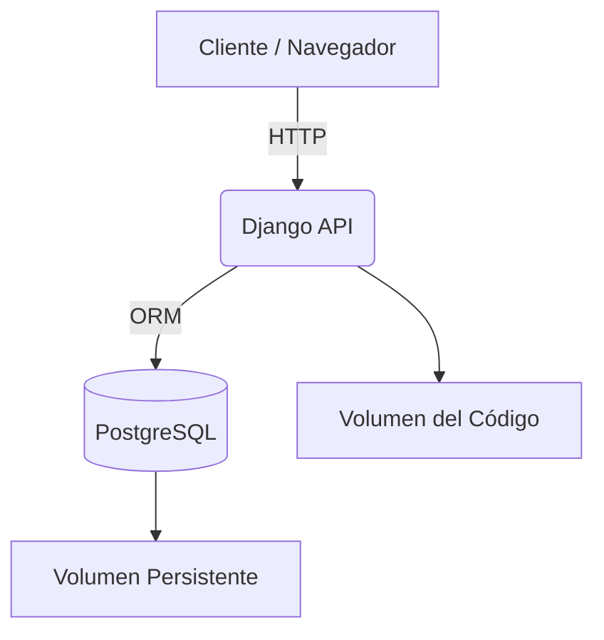
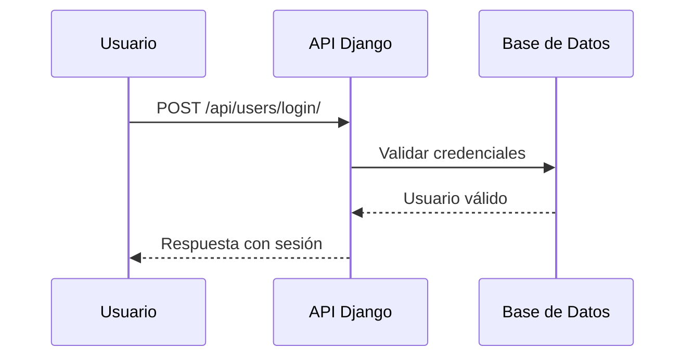

# 🚀 Proyecto Django + PostgreSQL + Docker  
Modern Dev Edition


---

# 📚 Tabla de Contenido
- [📦 Sobre el Proyecto](#-sobre-el-proyecto)
- [⚙️ Stack Tecnológico](#️-stack-tecnológico)
- [🧱 Arquitectura](#-arquitectura)
- [🐳 Docker Compose Overview](#-docker-compose-overview)
- [🚀 Instalación](#-instalación)
- [🧪 Uso](#-uso)
- [📡 Endpoints API](#-endpoints-api)
- [🗂 Estructura del Proyecto](#-estructura-del-proyecto)
- [🔧 Troubleshooting](#-troubleshooting)
- [🗺 Roadmap](#-roadmap)
- [📄 Licencia](#-licencia)

---

# 📦 Sobre el Proyecto
Este proyecto demuestra cómo crear un entorno **Django + PostgreSQL** completamente **dockerizado**, listo para desarrollo, con una API de usuarios basada en Django REST Framework.

💡 Perfecto para **bootcamps**, **entrevistas técnicas**, **prototipos** y **proyectos base**.

---

# ⚙️ Stack Tecnológico
- **Django 4.2**
- **Python 3.11**
- **Django REST Framework**
- **PostgreSQL 15**
- **Docker & Docker Compose**
- **Mermaid Diagrams**
- **Volúmenes persistentes**

---

# 🧱 Arquitectura

## 🔷 Arquitectura General


## 🔷 Flujo de Autenticación


---

# 🐳 Docker Compose Overview
```yaml
services:
  db:
    image: postgres:15-alpine
    environment:
      POSTGRES_DB: django_db
      POSTGRES_USER: django_user
      POSTGRES_PASSWORD: django_pass

  web:
    build: .
    command: python manage.py runserver 0.0.0.0:8000
    volumes:
      - .:/app
    ports:
      - "8000:8000"
    depends_on:
      - db
```

---

# 🚀 Instalación

### 1️⃣ Clonar el repositorio
```bash
git clone https://github.com/tuusuario/django-docker-postgres.git
cd django-docker-postgres
```

### 2️⃣ Construir contenedores
```bash
docker-compose build
```

### 3️⃣ Inicializar proyecto (solo primera vez)
```bash
docker-compose run --rm web django-admin startproject myproject .
docker-compose run --rm web python manage.py startapp users
```

### 4️⃣ Migraciones
```bash
docker-compose run --rm web python manage.py migrate
```

### 5️⃣ Crear superusuario
```bash
docker-compose run --rm web python manage.py createsuperuser
```

---

# 🧪 Uso

### Ejecutar el proyecto:
```bash
docker-compose up
```

### Acceder:
- API → http://localhost:8000/api/users/
- Admin → http://localhost:8000/admin/

---

# 📡 Endpoints API

| Método | Endpoint | Descripción |
|--------|----------|-------------|
| POST | `/api/users/` | Crear usuario |
| GET | `/api/users/` | Listar usuarios |
| POST | `/api/users/login/` | Autenticar |
| GET | `/api/users/me/` | Perfil logueado |
| POST | `/api/users/change_password/` | Cambiar contraseña |
| POST | `/api/users/logout/` | Cerrar sesión |

---

# 🗂 Estructura del Proyecto
```
proyecto/
├── docker-compose.yml
├── Dockerfile
├── requirements.txt
├── myproject/
│   ├── settings.py
│   ├── urls.py
│   └── wsgi.py
└── users/
    ├── models.py
    ├── views.py
    ├── serializers.py
    └── urls.py
```

---

# 🔧 Troubleshooting

### ❗ Base de datos no disponible
```bash
docker-compose logs db
```

### ❗ Cambios no aparecen en el servidor
```bash
docker-compose restart web
```

### ❗ Limpiar entorno Docker
```bash
docker system prune -a
docker volume prune
```

---

# 🗺 Roadmap
- [ ] Integrar JWT
- [ ] Añadir Nginx + Gunicorn
- [ ] Tests unitarios (pytest + DRF)
- [ ] CI/CD con GitHub Actions
- [ ] Documentación con Swagger/OpenAPI

---

# 📄 Licencia
Este proyecto está bajo licencia **MIT**.

---
